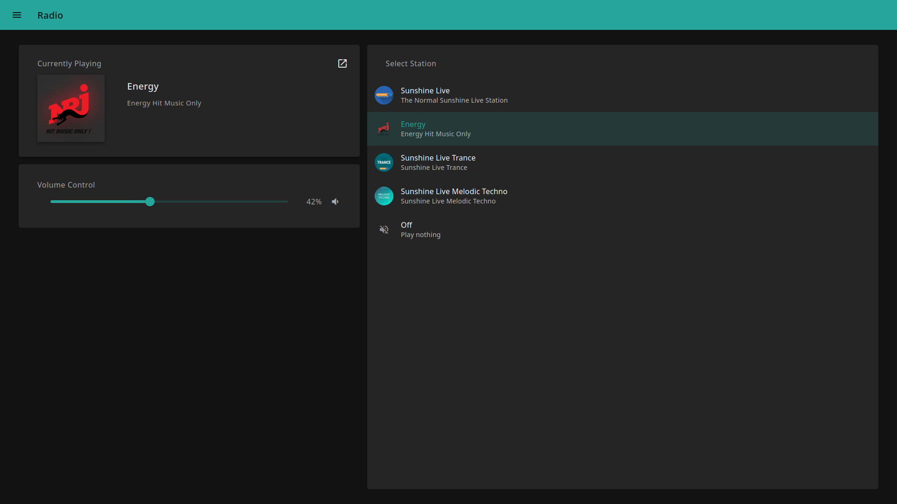

# Radio

A headless music player which supports internet radio and streaming.

## Getting Started

- Get the latest release from
  [github.com/MikMuellerDev/radio/releases](https://github.com/MikMuellerDev/radio/releases)
- Extract the tar archive

### Installation

- Make sure that `sudo` is installed on the target machine
- Execute the file `install.sh` as non-root
- The application files will be installed at `/usr/bin/radio`
- The configuration file will be installed at `/etc/radio/config.toml`
- Radio can then be controlled via `systemd`:
  `sudo systemctl enable radio --now`

### Without Installation

- Execute the following command to start radio `./radio run`
- On the first launch, a new configuration file will be created without starting the service

## Screenshots

### Dashboard

### Login screen

